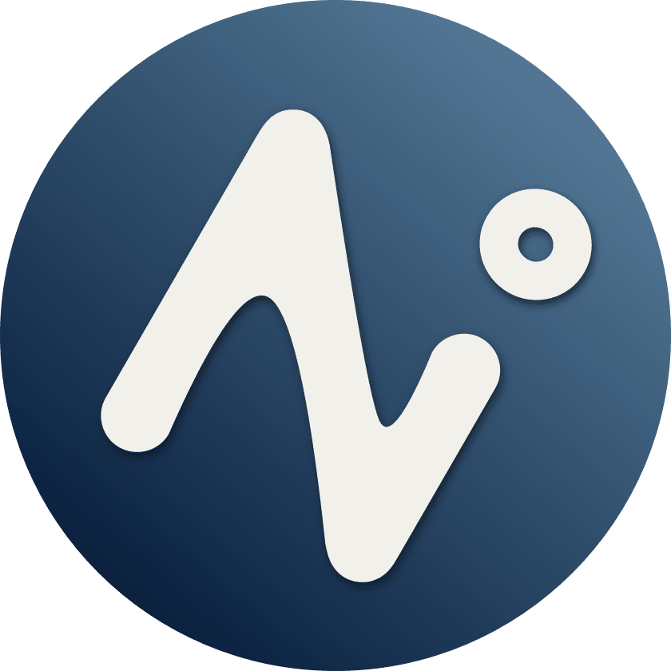

<h2 align="center">
  
  
AI + Tools + Plugins + Community

</h2>

## Feature

- Support for loading any URL and system tray
- Theme Mode (Light/Dark)
- Multiple Languages

## TODO

- Notes
- Toolset
- Plugin system

## 中国用户

国内用户如果遇到使用问题或者想交流 Noi，可以关注公众号「**浮之静**」，发送 “**noi**” 进群参与讨论。开源不易，如果 Noi 应用对你有帮助可以分享给更多人，或者微信扫码打赏。

 