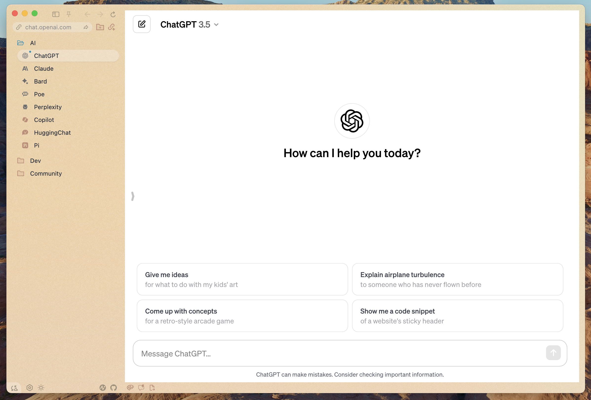
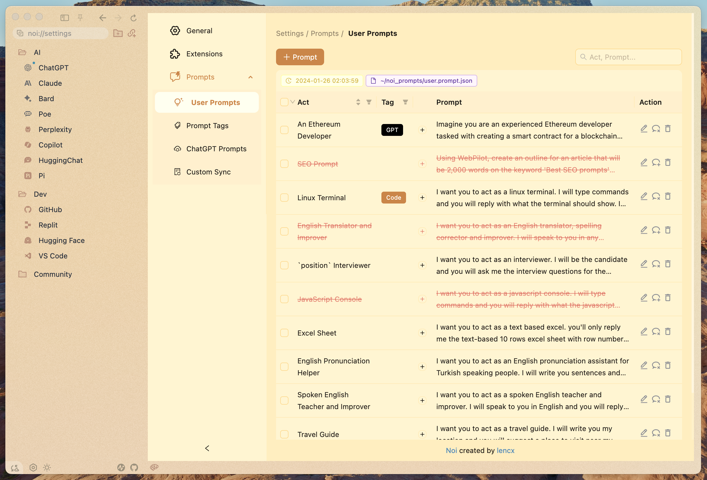

<h2 align="center">
  
  <p>AI + Tools + Plugins + Community</p>
</h2>

[](https://github.com/lencx/Noi/releases)

<a href="https://www.buymeacoffee.com/lencx" target="_blank"></a>

## Feature

- Support for loading any URL and system tray
- Theme Mode (Light/Dark)
- Multiple Languages
- Prompt Management
- AI Batch Questioning
- ...

## Install

- **macOS**
  - [⬇️ x64](https://github.com/lencx/Noi/releases/download/v0.2.1/Noi_macos_0.2.1.dmg)
  - [⬇️ arm64](https://github.com/lencx/Noi/releases/download/v0.2.1/Noi_macos_0.2.1-arm64.dmg)
- **Windows**
  - [⬇️ x64](https://github.com/lencx/Noi/releases/download/v0.2.1/Noi-win32-x64-0.2.1-setup.exe)
- **Linux**
  - [⬇️ AppImage](https://github.com/lencx/Noi/releases/download/v0.2.1/Noi_linux_0.2.1.AppImage)
  - [⬇️ amd64.deb](https://github.com/lencx/Noi/releases/download/v0.2.1/noi_linux_amd64_0.2.1.deb)

|Preview|Preview|
|---|---|
|||
|||

---

[](https://star-history.com/#lencx/Noi&Timeline)

## FAQ

### macOS

If you encounter the error message "Noi" is damaged and can't be opened. You should move it to the Trash. while installing software on macOS, it may be due to security settings restrictions in macOS. To solve this problem, please try the following command in Terminal:

```bash
xattr -cr /Applications/Noi.app
```


## TODO

- Notes
- Toolset
- Plugin system

## 中国用户

国内用户如果遇到使用问题或者想交流 Noi，可以关注公众号「**浮之静**」，发送 “**noi**” 进群参与讨论。如果 Noi 应用对你有帮助可以分享给更多人，或者微信扫码打赏。

 
