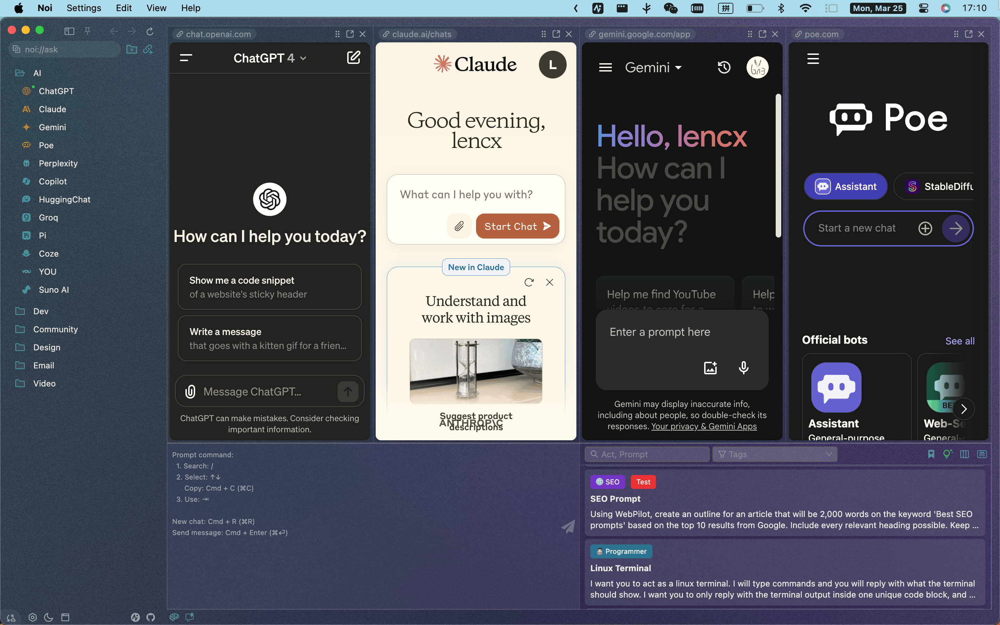
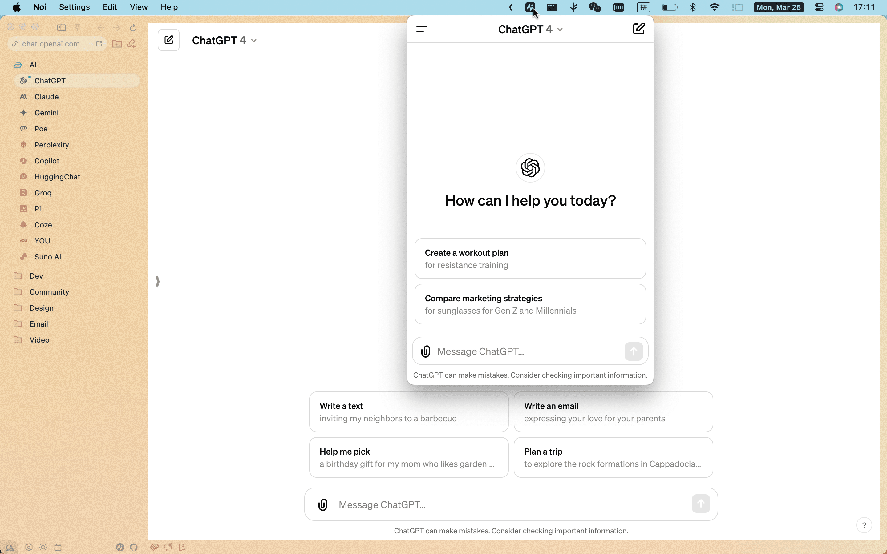
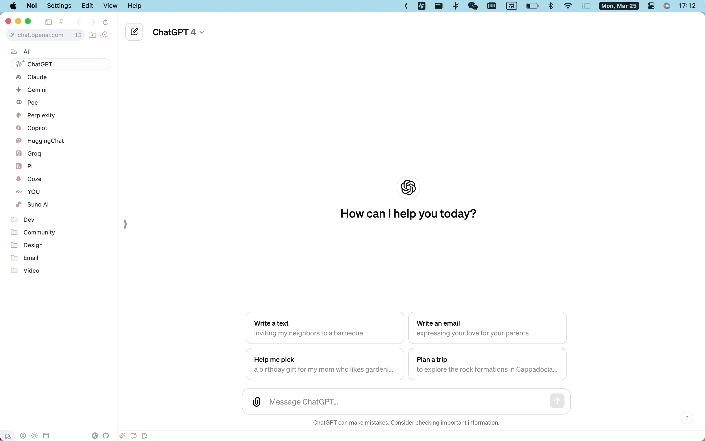
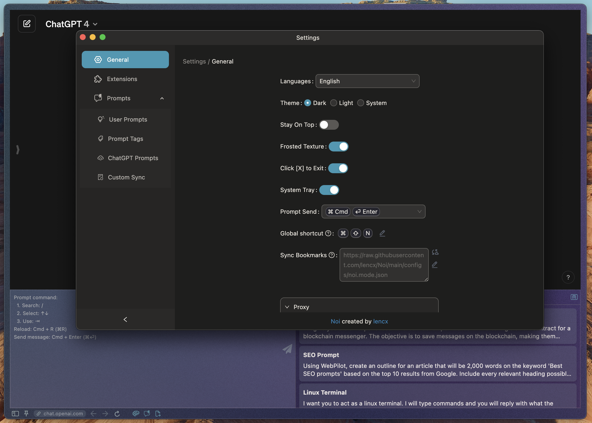
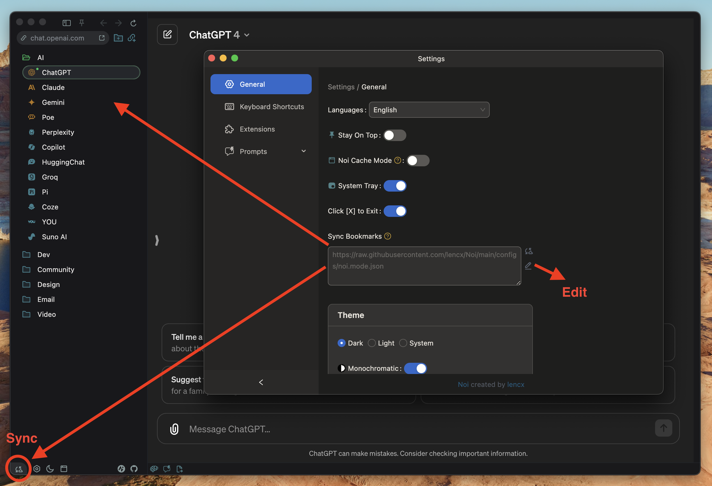
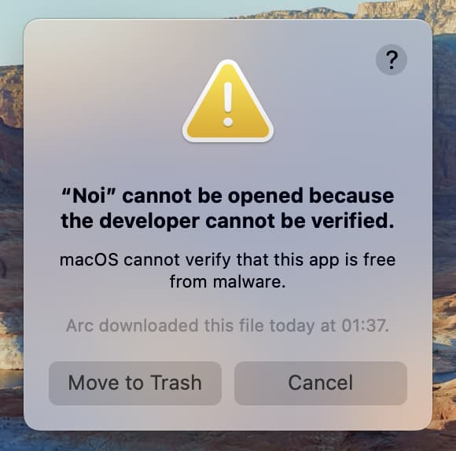
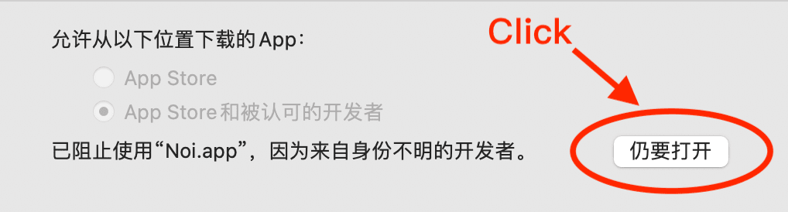

<p align="center">
  
  <p align="center">🚀 Power Your World with AI - Explore, Extend, Empower.</p>
</h2>

[](https://github.com/lencx/Noi/releases) [](https://discord.gg/kq2HXcpJSQ)

<a href="https://www.buymeacoffee.com/lencx" target="_blank"></a>

## 🔥 Feature

Introducing Noi: an AI-enhanced, customizable browser designed to streamline your digital experience:

- **Browser**: Noi not only includes curated AI websites but also allows the addition of any URL, providing a tailored browsing experience ([Noi Configs](./configs)).
- **Prompts Management**: Offers robust customization options including the addition, synchronization, batch tagging, and removal of prompts.
- **Noi Ask**: Enables sending batch messages to multiple AI chats, streamlining the process of interacting with various AI services simultaneously ([Noi Extensions](./extensions)). Entries made via Noi Ask are stored locally, ensuring easy access for future review or bookmarking.
- **Themes**: `Light`/`Dark`/`System`/`Monochromatic`/`Frosted Texture`
- **Noi Cache Mode**: Noi reimagines interaction without the traditional concept of browser tabs. In this mode, links accessed via the sidebar are cached for quick swapping (accessible via `Menu -> Settings -> Noi Cache Mode`).
- **Cookie Data Isolation**: Supports the use of multiple accounts on the same website, catering to diverse user requirements.
- **Discover More**: There are numerous details waiting for your discovery...

## ⬇️ Download

[🕒 History versions...](https://github.com/lencx/Noi/releases)

- **macOS**
  - [⬇️ x64](https://github.com/lencx/Noi/releases/download/v0.4.0/Noi_macos_0.4.0.dmg)
  - [⬇️ arm64](https://github.com/lencx/Noi/releases/download/v0.4.0/Noi_macos_0.4.0-arm64.dmg)
- **Windows**
  - [⬇️ x64](https://github.com/lencx/Noi/releases/download/v0.4.0/Noi-win32-x64-0.4.0-setup.exe)
- **Linux**
  - [⬇️ AppImage](https://github.com/lencx/Noi/releases/download/v0.4.0/Noi_linux_0.4.0.AppImage)
  - [⬇️ amd64.deb](https://github.com/lencx/Noi/releases/download/v0.4.0/noi_linux_amd64_0.4.0.deb)

|Preview|Preview|
|---|---|
|||
|||
|||

## ⚙️ Noi Configs

[📁 configs](./configs)

### Noi Mode

To set up a custom sync link, follow the steps below:

- **Step 1**: Open the settings (on macOS: `cmd`+`,`, on Windows: `ctrl`+`,`)
- **Step 2**: Edit the URL in `Mode Sync`
- **Step 3** or **Step 4**: Click the `sync` button to start synchronizing data

> [!NOTE]
> The `custom url` will not be overwritten. If you wish to use your own URL as a data source, please refer to the data format in `noi.mode.json`.



#### Sync URL

- [AI](configs/noi.mode.json): Popular AI websites and communities (e.g., ChatGPT, Gemini, Claude, Poe, etc.).

  ```bash
  https://raw.githubusercontent.com/lencx/Noi/main/configs/noi.mode.json
  ```

- [AI（内陆版）](configs/noi.mode.cn.json): 主流 AI 及国内 AI（如：通义千问、扣子、豆包、智谱清言、讯飞星火、文心一言等）。

  ```bash
  https://raw.githubusercontent.com/lencx/Noi/main/configs/noi.mode.cn.json
  ```

#### noi.mode.json

Here is a detailed description of some fields:

- `name`: Name (optional, has no significance)
- `version`: Version change
- `sync`: URL information (optional, has no significance)
- `modes[]`:
  - `id`: A unique identifier (use a random string; do not use formats like `noi:xxx` or `noi@xxx` as these are reserved for internal use within Noi)
  - `parent`: The parent folder this item belongs to (supports nesting)
  - `text`: Name
  - `url`: Link
  - `dir`: Whether it is a folder, default is `false`

### Proxy

Learn more: [electronjs/docs](https://www.electronjs.org/docs/latest/api/session#sessetproxyconfig)

- `proxyRules`: Rules indicating which proxies to use.
- `proxyBypassRules`: Rules indicating which URLs should bypass the proxy settings.

## 🧩 Noi Extensions

[📁 extensions](./extensions)

Note that Noi does not support the full range of Chrome extensions APIs. See Supported Extensions APIs for more details on what is supported.

Learn more: [electronjs/doc](https://www.electronjs.org/docs/latest/api/extensions)

<!-- EXTENSIONS_START -->
| Name | Version | Description |
| --- | --- | --- |
| [@noi/ask](https://github.com/lencx/Noi/tree/main/extensions/noi-ask) | 0.1.12 | The best assistant for batch asking and quick typing of prompts. |
| [@noi/ask-custom](https://github.com/lencx/Noi/tree/main/extensions/noi-ask-custom) | 0.1.0 | The best assistant for batch asking and quick typing of prompts. |
| [@noi/export-chatgpt](https://github.com/lencx/Noi/tree/main/extensions/noi-export-chatgpt) | 0.1.1 | ChatGPT chat history export, supports PDF, Image, and Markdown formats. |
| [@noi/reset](https://github.com/lencx/Noi/tree/main/extensions/noi-reset) | 0.1.3 | Reset certain website styles to enhance compatibility with Noi. |
<!-- EXTENSIONS_END -->

[](https://star-history.com/#lencx/Noi&Timeline)

# 🌐 Noi Languages

[📁 locales](./locales)

- `en`: English
- `fa`: فارسی
- `zh`: 简体中文
- `zh_Hant`: 繁體中文
- `ja`: 日本語
- `ko`: 한국어
- `fr`: Français
- `es`: Español
- `pt`: Português
- `ru`: Русский
- `de`: Deutsch
- `it`: Italiano
- `tr`: Türkçe
- `hu`: Magyar

## ⚠️ FAQ

### macOS

If you encounter the error message "Noi" is damaged and can't be opened. You should move it to the Trash. while installing software on macOS, it may be due to security settings restrictions in macOS.



To solve this problem, please choose Apple menu  > System Preferences, then click Security & Privacy and choose General tab:



or try the following command in Terminal:

```bash
xattr -cr /Applications/Noi.app
```

## 中国用户

> [!NOTE]
> Noi 目前未做应用自动更新，需要自己留意此项目的新版本发布（如果有 GitHub 账号的，可以 watch 或 star）。

这里有两篇使用文档，对 Noi 的理念和插件系统做了详细介绍，推荐新手仔细阅读。

- [Noi：跨平台定制化浏览器，最得力 AI 助手](https://mp.weixin.qq.com/s/dAN7LOw7mH609HdAyEvXfg)
- [Noi：插件介绍](https://mp.weixin.qq.com/s/M6gO6MdK5obCvs2LIBZA3w)

国内用户如果遇到使用问题或者想交流 Noi，可以关注公众号「**浮之静**」，发送 “**noi**” 进群参与讨论。如果 Noi 应用对你有帮助可以分享给更多人，或者微信扫码打赏。

 
