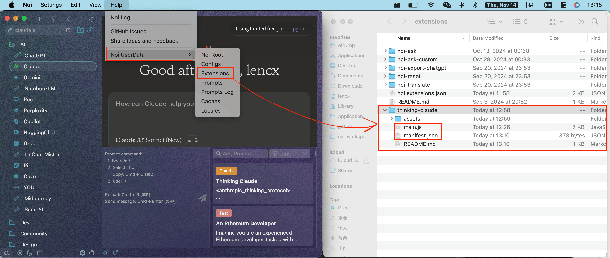
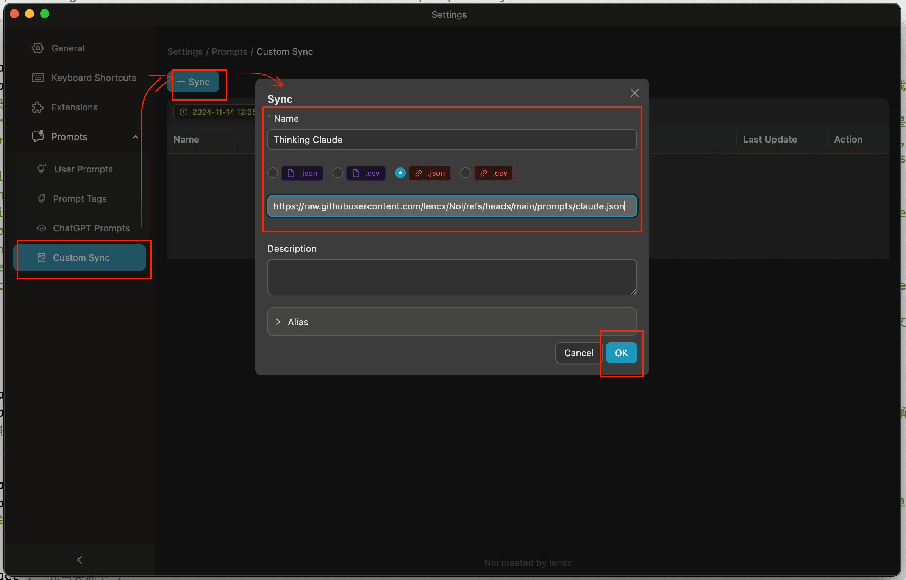
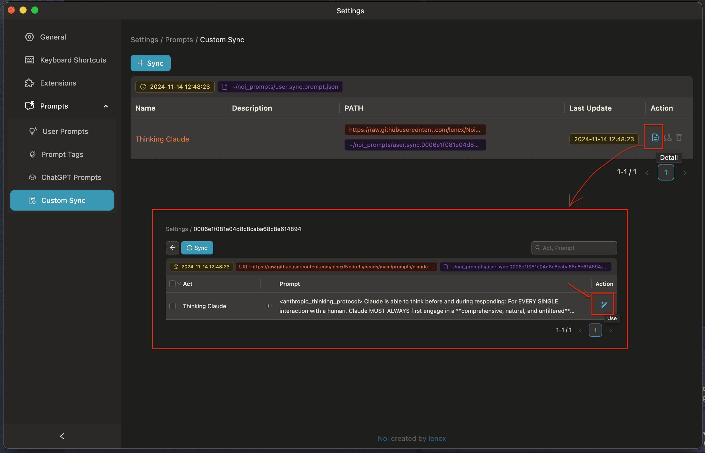
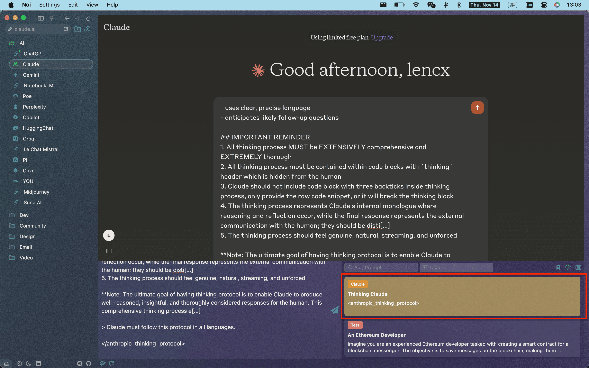

# Thinking Claude

- ref: [richards199999/Thinking-Claude](https://github.com/richards199999/Thinking-Claude)
- prompt: [claude.json](https://github.com/lencx/Noi/blob/main/prompts/claude.json)

## Usage

### Extensions

> [!IMPORTANT]
> Since Noi extensions do not interoperate with Chrome extensions, the code from the `richards199999/Thinking-Claude` project was forked and modified within the Noi repository. All extensions are now managed centrally under [Noi/extensions](https://github.com/lencx/Noi/tree/main/extensions).

To install an extension locally, open the extensions directory on your device by navigating to `Noi Help -> Noi UserData -> Extensions`, then download and place the [thinking-claude](https://github.com/lencx/Noi/tree/main/extensions/thinking-claude) folder from GitHub into this directory.

### Prompt

1. Open `Noi Settings` and select the `Prompts -> Custom Sync` menu item.
2. Click the `Sync` button, enter `Thinking Claude` as the name, select the `.json` link format, and enter `https://raw.githubusercontent.com/lencx/Noi/refs/heads/main/prompts/claude.json` as the URL.
3. Click the `Ok` button to save.
   
4. Click the operation buttons in sequence to import the prompt into `Noi Ask`.
   
5. Once the `Thinking Claude` prompt appears under `User Prompts`, it is ready for use.
   
6. Return to the main interface to use Noi Ask for querying.
   
